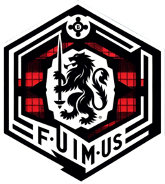

<!-- README.md is generated from README.Rmd. Please edit that file -->

# **fuimus** <a href="https://andrewallenbruce.github.io/fuimus/"></a>

> /ˈfu.i.mus/, \[ˈfuɪmʊs̠\]
>
> Literally, *“we have been”* in Latin. Often interpreted as *“We have
> endured”* or *“We have always been”*, proclaiming the long history of
> the user.
>
> Can often be seen as a family motto (e.g., the Lowlands Scottish [Clan
> Bruce](https://en.wikipedia.org/wiki/Clan_Bruce)).

<!-- badges: start -->

[](https://app.codecov.io/gh/andrewallenbruce/fuimus?branch=master)
[](https://github.com/andrewallenbruce/fuimus/commits/master)
[](https://github.com/andrewallenbruce/fuimus)
[](https://www.codefactor.io/repository/github/andrewallenbruce/fuimus)
<!-- badges: end -->

## :package: Installation

You can install **fuimus** from [GitHub](https://github.com/) with:

``` r
# install.packages("pak")
pak::pak("andrewallenbruce/fuimus")
```

------------------------------------------------------------------------

## :balance_scale: Code of Conduct

Please note that the `fuimus` project is released with a [Contributor
Code of
Conduct](https://andrewallenbruce.github.io/fuimus/CODE_OF_CONDUCT.html).
By contributing to this project, you agree to abide by its terms.

## :classical_building: Governance

This project is primarily maintained by [Andrew
Bruce](https://github.com/andrewallenbruce). Other authors may
occasionally assist with some of these duties.
